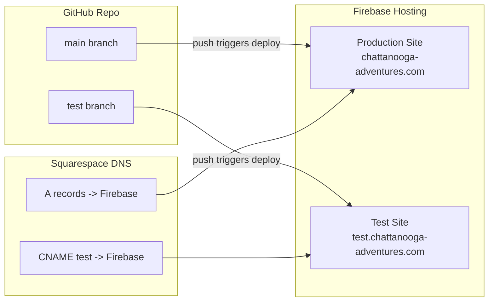

# Migrate to Firebase Hosting with Test Subdomain

## Current State

- Static site: `index.html`, `404.html`, `style.css`, `script.js`
- Deployed to InfinityFree via FTP using `[.github/workflows/ftp_deploy.yml](.github/workflows/ftp_deploy.yml)`
- Apache-specific `[.htaccess](.htaccess)` for HTTPS redirect and custom 404
- Domain managed via Squarespace DNS

## Architecture Overview




---

## Step 1: Firebase Project Setup (Manual — Firebase Console)

These are manual steps you will need to do in the [Firebase Console](https://console.firebase.google.com):

1. Create a new Firebase project (e.g., `chattanooga-adventures`)
2. Go to **Hosting** and set up two hosting sites:
  - **Production site**: `chattanooga-adventures` (default site)
  - **Test site**: `chattanooga-adventures-test` (add via "Add another site")
3. Connect custom domains in Firebase Hosting settings:
  - For the production site: add `chattanooga-adventures.com` and `www.chattanooga-adventures.com`
  - For the test site: add `test.chattanooga-adventures.com`
  - Firebase will give you DNS records (A records and TXT records) to add in Squarespace for verification

---

## Step 2: Generate a Firebase CI Token (Manual)

For GitHub Actions to deploy, you need a service account or CI token:

1. Install Firebase CLI locally: `npm install -g firebase-tools`
2. Run `firebase login:ci` to generate a CI token
3. Add the token as a GitHub repository secret named `FIREBASE_TOKEN`
  - Go to your repo on GitHub -> Settings -> Secrets and variables -> Actions -> New repository secret

---

## Step 3: Add Firebase Configuration Files

### `firebase.json` (new file)

This replaces `.htaccess` functionality. Firebase handles HTTPS automatically (no redirect rule needed), and the `cleanUrls` / custom 404 config replaces the Apache ErrorDocument directive.

```json
{
  "hosting": {
    "public": ".",
    "ignore": [
      "firebase.json",
      ".firebaserc",
      ".github/**",
      ".gitignore",
      ".htaccess",
      "README.md"
    ],
    "cleanUrls": true,
    "trailingSlash": false,
    "headers": [
      {
        "source": "**/*.@(js|css|html)",
        "headers": [
          {
            "key": "Cache-Control",
            "value": "max-age=3600"
          }
        ]
      }
    ]
  }
}
```

Firebase automatically serves `404.html` as the custom 404 page when it exists in the public directory — no extra config needed.

### `.firebaserc` (new file)

Maps deploy targets to the two hosting sites:

```json
{
  "projects": {
    "default": "chattanooga-adventures"
  },
  "targets": {
    "chattanooga-adventures": {
      "hosting": {
        "production": ["chattanooga-adventures"],
        "test": ["chattanooga-adventures-test"]
      }
    }
  }
}
```

Note: Replace `chattanooga-adventures` and `chattanooga-adventures-test` with the actual site IDs from Firebase Console if they differ.

---

## Step 4: Replace GitHub Actions Workflow

### Delete the old FTP workflow

Remove `[.github/workflows/ftp_deploy.yml](.github/workflows/ftp_deploy.yml)`.

### Create production deploy workflow: `.github/workflows/firebase_deploy.yml`

Triggers on push to `main`, deploys to the production hosting target.

```yaml
name: Deploy to Firebase (Production)

on:
  push:
    branches:
      - main

jobs:
  deploy:
    name: Deploy to Firebase Hosting (Production)
    runs-on: ubuntu-latest

    steps:
      - name: Checkout repo
        uses: actions/checkout@v4

      - name: Deploy to Firebase
        uses: FirebaseExtended/action-hosting-deploy@v0
        with:
          repoToken: ${{ secrets.GITHUB_TOKEN }}
          firebaseServiceAccount: ${{ secrets.FIREBASE_SERVICE_ACCOUNT }}
          channelId: live
          target: production
```

### Create test deploy workflow: `.github/workflows/firebase_deploy_test.yml`

Triggers on push to `test`, deploys to the test hosting target.

```yaml
name: Deploy to Firebase (Test)

on:
  push:
    branches:
      - test

jobs:
  deploy:
    name: Deploy to Firebase Hosting (Test)
    runs-on: ubuntu-latest

    steps:
      - name: Checkout repo
        uses: actions/checkout@v4

      - name: Deploy to Firebase
        uses: FirebaseExtended/action-hosting-deploy@v0
        with:
          repoToken: ${{ secrets.GITHUB_TOKEN }}
          firebaseServiceAccount: ${{ secrets.FIREBASE_SERVICE_ACCOUNT }}
          channelId: live
          target: test
```

**Note on authentication:** The `FirebaseExtended/action-hosting-deploy` action prefers a **service account key** stored as `FIREBASE_SERVICE_ACCOUNT` (a JSON key). You generate this in Firebase Console -> Project Settings -> Service Accounts -> "Generate new private key". Store the entire JSON content as the `FIREBASE_SERVICE_ACCOUNT` secret in GitHub. This is preferred over the CI token approach (Step 2 can be skipped if using this method).

---

## Step 5: Create the `test` Branch

Create a `test` branch from `main`:

```bash
git checkout -b test
git push -u origin test
```

Going forward, merging or pushing to `test` deploys to `test.chattanooga-adventures.com`, and merging/pushing to `main` deploys to `chattanooga-adventures.com`.

---

## Step 5b: Add `robots.txt` on the `test` Branch

After creating the `test` branch, add a `robots.txt` file **only on the test branch** to prevent search engines from indexing the test site:

```
User-agent: *
Disallow: /
```

This file should NOT exist on the `main` branch so that the production site remains fully crawlable.

---

## Step 6: Update Squarespace DNS

In Squarespace Domains -> DNS Settings for `chattanooga-adventures.com`:

1. **Remove** any existing A records or CNAME records pointing to InfinityFree
2. **Add** the DNS records Firebase provides during custom domain setup (Step 1). Typically:
  - **A records** for `chattanooga-adventures.com` pointing to Firebase's IPs (e.g., `199.36.158.100`)
  - **TXT record** for domain verification (Firebase will show the exact value)
  - **CNAME** for `www` -> Firebase-provided target
  - **CNAME** for `test` -> Firebase-provided target (for `test.chattanooga-adventures.com`)
3. Wait for DNS propagation and SSL provisioning (Firebase handles SSL automatically; may take up to 24 hours)

---

## Step 7: Update `.gitignore`

Add Firebase cache directory:

```
.firebase/
```

---

## Step 8: Clean Up

- The `[.htaccess](.htaccess)` file can be deleted since Firebase handles HTTPS automatically and the custom 404 is configured via `firebase.json` / convention
- Remove the old InfinityFree secrets from GitHub (`INFINITY_FTP_HOST`, `INFINITY_FTP_USERNAME`, `INFINITY_FTP_PASSWORD`) once migration is confirmed working

---

## Files Changed Summary


| Action | File |
| ------ | ---- |


- **Create**: `firebase.json` — Firebase hosting configuration
- **Create**: `.firebaserc` — Firebase project/target mapping
- **Create**: `.github/workflows/firebase_deploy.yml` — Production deploy on push to main
- **Create**: `.github/workflows/firebase_deploy_test.yml` — Test deploy on push to test
- **Delete**: `.github/workflows/ftp_deploy.yml` — Old InfinityFree FTP deploy
- **Delete**: `.htaccess` — No longer needed (Firebase handles HTTPS + 404)
- **Modify**: `.gitignore` — Add `.firebase/` directory
- **Create** (test branch only): `robots.txt` — Block search engine indexing on the test site

